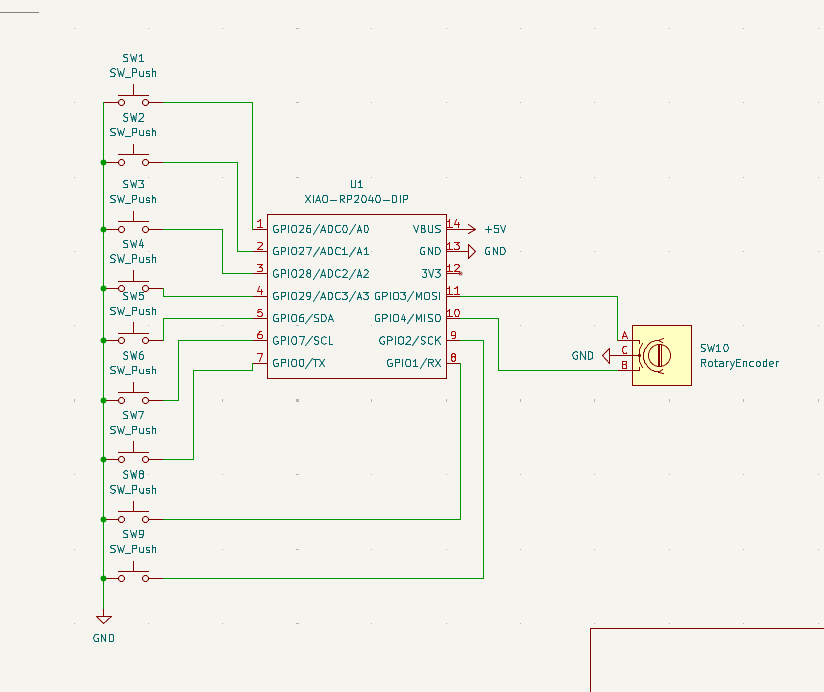
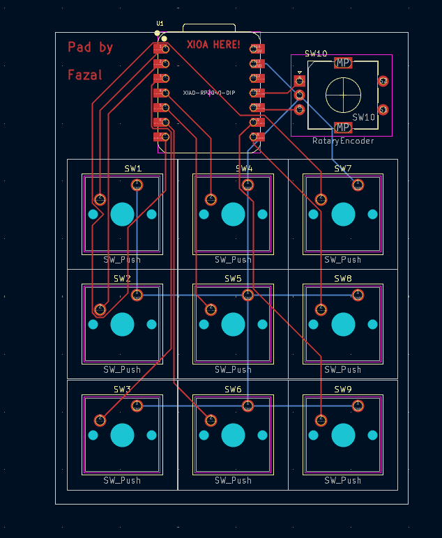
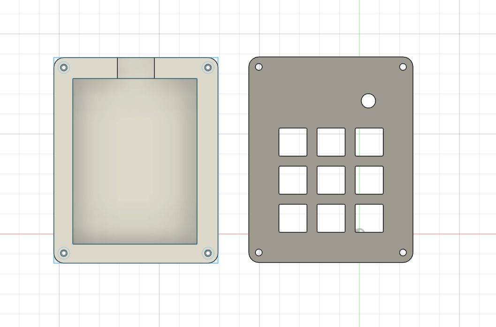

Pad by Fazal (XIAO RP2040)
---

This is a custom 9-key macro pad with a rotary encoder.

It is built using the Seeed Studio XIAO RP2040 and runs the KMK (CircuitPython) firmware.

🛠️ Hardware Overview
---

Microcontroller: Seeed Studio XIAO RP2040 (XIAO-RP2040-DIP)

Key Switches: 9 Mechanical Keys (3 columns x 3 rows) (SW_Cherry_MX_1.00u_PCB)

Rotary Encoder: 1 (Standard 2-pin data, without the push-button function) (RotaryEncoder_Alps_EC11E)

BOM
---
- 9x Cherry MX Switches

- 1× EC11-E Rotary Encoder (with push-button switch)

- 1x XIAO RP2040

- 9x Blank DSA Keycaps

- 4x M3x16 Bolt

- 4x M3 Heatset

| Schematic | PCB | Case|
|----------|----------|----------|
|     |      |      |

